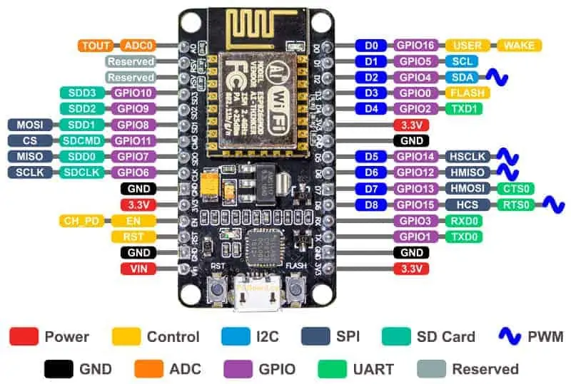

CP210x USB VCP Driver: https://www.silabs.com/developers/usb-to-uart-bridge-vcp-drivers

Image from https://www.make-it.ca/nodemcu-details-specifications/

DO - GPIO16  
D1 - GPIO5  
D2 - GPIO4  
D3 - GPIO0  

Information for DRV8833: https://www.ti.com/lit/ds/symlink/drv8833.pdf?ts=1650835991964&ref_url=https%253A%252F%252Fwww.google.com%252F

Amazon DRV8833 Link: https://www.amazon.com/dp/B08RMWTDLM?psc=1&ref=ppx_yo2ov_dt_b_product_details

Amazon ESP8266 Link: https://www.amazon.com/dp/B07RNX3W9J?psc=1&ref=ppx_yo2ov_dt_b_product_details

Circuit Diagram

Finished STEM Bot v2

